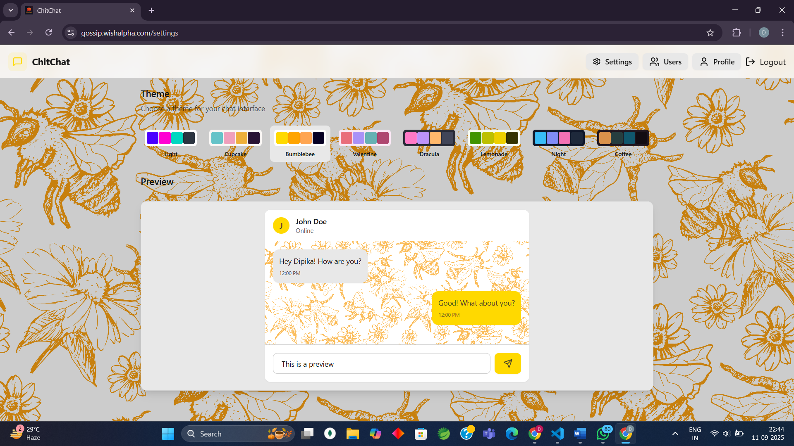

# 💬 Gossip — Real-time Chat Application

Welcome to **Gossip**, a real-time chat application where users can connect, chat, and have fun together!  
Built with **React, Tailwind, Zustand, Express, MySQL, ShadCN UI, MongoDB, and Socket.IO** for seamless communication, it offers users a rich messaging experience.

---

## 📌 Table of Contents

- [Introduction](#-introduction)
- [Features](#-features)
- [Architecture](#-architecture)
- [Tech Stack](#-tech-stack)
- [Installation & Setup](#-installation--setup)
- [Usage](#-usage)
- [API / Socket Events](#-api--socket-events)
- [Database Schema](#-database-schema)
- [Screenshots](#-screenshots)
- [Future Enhancements](#-future-enhancements)
- [Contributing](#-contributing)
- [License](#-license)
- [Contact](#-contact)

---

## 🚀 Introduction

**Gossip** is a modern real-time chat app that allows users to:

- Create accounts and log in
- Join group chats
- Send & receive messages instantly
- See online/offline user status
- Enjoy a smooth chat experience powered by WebSockets
- One-on-One chats
- Send & receive images instantly
- Update your own profile
- Making friends requests & connections

---

## ✨ Features

### 🔐 Authentication & Account Management

- ✅ **User Registration & Login** with JWT
- 🔄 **OTP Verification & Resend OTP**
- 🔑 **Forgot Password & Reset Password**
- 🛡️ **Secure Session Management** (force logout on token expiry)
- 📝 **Profile Update & Check Authentication Status**

### 👥 Group & Chat Features

- 🆕 **Create, Update, and Delete Groups**
- 📋 **Get Single or All Groups**
- 💬 **Send & Receive Group Messages**
- 🗂️ **Get Groups for Sidebar Navigation**
- 🚪 **Leave Group Functionality**

### 💌 Direct Messaging & Friend Management

- 💬 **Send & Receive Private Messages**
- 🧹 **Delete All Chats**
- 🚫 **Block & Unblock Users**
- 🤝 **Friend Requests**: send, accept, reject, cancel, toggle
- 👥 **Manage Friends**: unfriend, get friends list, get online friends
- 📋 **View Friend Requests**

### 🟢 Online Presence

- 🌐 **Real-time Online User Tracking**
- 👀 **Get Online Friends**

### ⚡ Real-Time Communication

- 🖥️ **100% WebSocket-Based Communication** (Socket.IO)
- 📜 **Encrypted Chat History** stored in MongoDB
- 🎨 **Responsive UI** built with React, Tailwind & Zustand

---

## 🛠️ Tech Stack

- **Frontend:** React, Tailwind CSS, Zustand, Socket.IO-client, ShadCN UI
- **Backend:** Express, Socket.IO, MongoDB, MySql, JWT
- **Database:** MongoDB, MySQL
- **Deployment:** Server

---

## 🏗️ Architecture

🖥️ Frontend (React + Tailwind + Zustand + ShadCN UI) ---> 🔌 WebSocket (Socket.IO) ---> 🗄️ Backend (Express + Socket.IO + MongoDB + MySQL) ---> 💾 Database (MongoDB + MySQL)

---

## ⚙️ Installation & Setup

### 1. Clone the repositories

```bash
git clone https://github.com/Mandal03Dipika/Gossip_Backend.git
git clone https://github.com/Mandal03Dipika/Gossip_Frontend.git
```

### 2. Backend Setup

Navigate to the backend directory:

```bash
cd Gossip_Backend
```

Install dependencies:

```bash
npm install
```

Create a .env file and add your environment variables:

```bash
PORT=5000
MONGO_URI=your-mongodb-url
JWT_SECRET=your-secret-key
```

Run the backend server:

```bash
npm run dev
```

### 2. Frontend Setup

Navigate to the frontend directory:

```bash
cd Gossip_Frontend
```

Install dependencies:

```bash
npm install
```

Run the frontend server:

```bash
npm run dev
```

The app will be available at http://localhost:5173.

---

## ▶️ Usage

- Open the frontend in your browser.
- Register or log in to your account.
- Create or join a group to start chatting.
- Send and receive messages in real-time.
- Manage your profile and friend requests.

---

## 🔌 API & Socket Events

### Authentication

- **register** : Register a new user
- **login** : Authenticate and obtain a JWT
- **verifyOtp** : Verify OTP during registration
- **resendOtp** : Resend OTP
- **forgotPassword** : Initiate password reset
- **verifyResetOtp** : Verify OTP for password reset
- **resetPassword** : Reset user password
- **logout** : Log out the user
- **update** : Update user profile
- **checkAuth** : Check if the user is authenticated

### Groups

- **createGroup** : Create a new group
- **updateGroup** : Update group details
- **deleteGroup** : Delete a group
- **getGroup** : Get a single group by ID
- **getAllGroup** : Get all groups
- **sendGroupMessage** : Send a message to a group
- **getGroupMessages** : Get messages from a group
- **getGroupsForSidebar** : Get groups for sidebar navigation
- **leaveGroup** : Leave a group

### Messaging & Friends

- **sendMessage** : Send a private message
- **getMessages** : Get private messages
- **sendFriendRequest** : Send a friend request
- **acceptFriendRequest** : Accept a friend request
- **rejectFriendRequest** : Reject a friend request
- **cancelFriendRequest** : Cancel a sent friend request
- **toggleFriendRequest** : Toggle the status of a friend request
- **unfriendUser** : Unfriend a user
- **getFriendRequests** : Get all friend requests
- **getFriends** : Get all friends
- **getOnlineFriends** : Get online friends
- **blockUser** : Block a user
- **unblockUser** : Unblock a user

### Online Presence

- **getOnlineUsers** : Get a list of online users

---

## 📸 Screenshots



---

## 🤝 Contributing

We welcome contributions! To contribute:

- Fork the repository.
- Create a new branch (git checkout -b feature/your-feature).
- Make your changes.
- Commit your changes (git commit -am 'Add new feature').
- Push to the branch (git push origin feature/your-feature).
- Create a new Pull Request.

**_Instruction : Don't merge anything to the main branch without sir's permission or discussion._**

---

## 📧 Contact

For any inquiries, please contact:

- Email : samirram007@gmail.com


